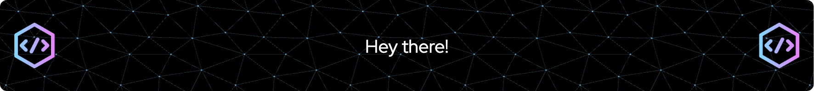

# Hey there! 👋

I'm an **Embedded Systems Engineer** who loves diving deep into code and making hardware come alive. When I'm not wrestling with bits and bytes, you might find me exploring the quirks of Rust (the language, not the oxidized metal).

- 🔧 **My favourite Languages**:
    

    
    
    
  

